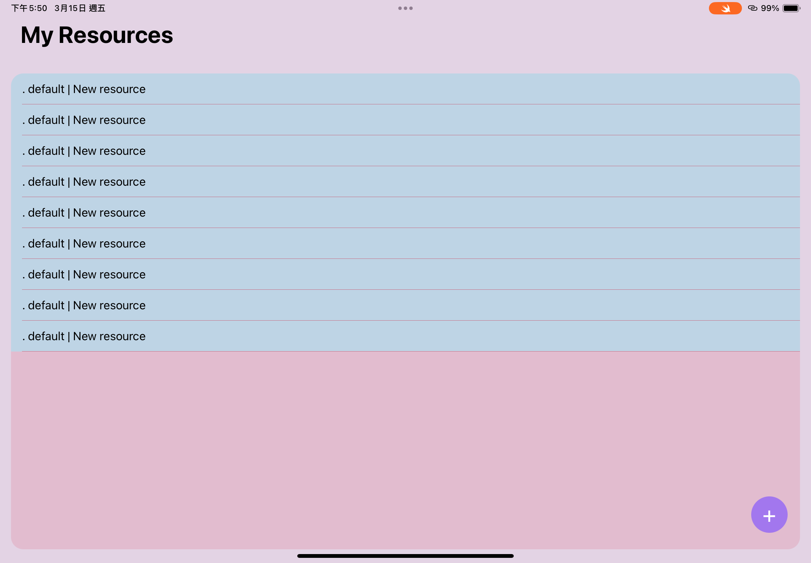
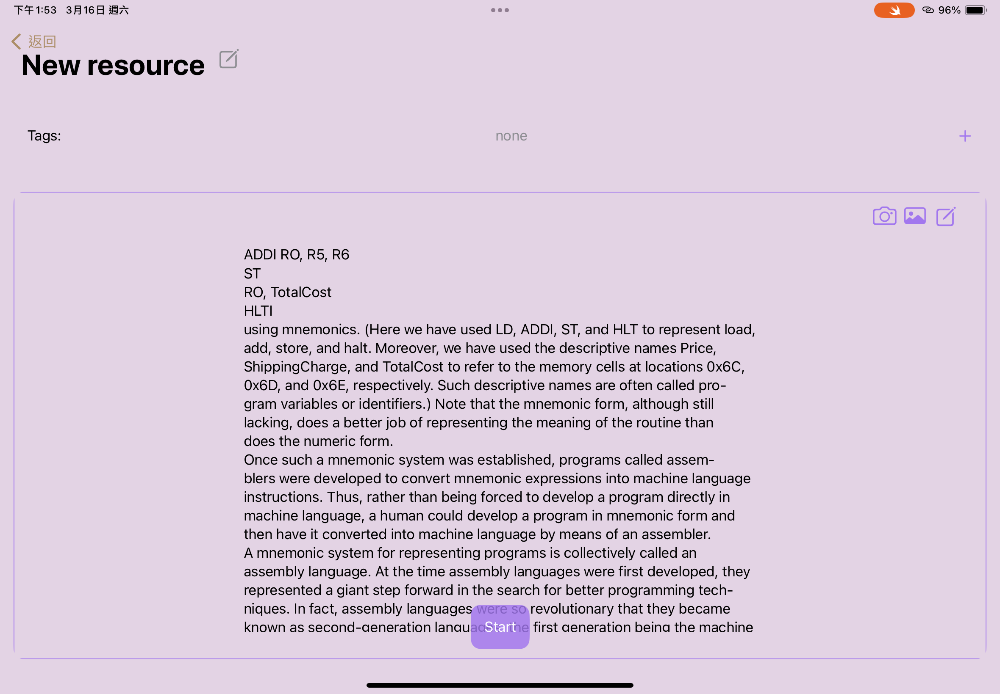
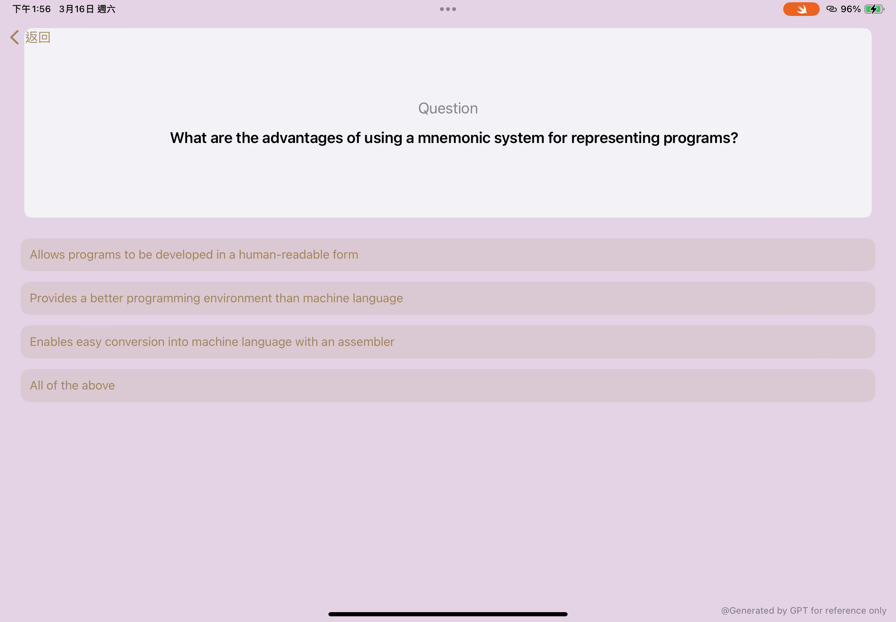

# Rememberer

- Improve learning efficiency and solidity.
- Recognize text from image by OCR API.
- Based on text of recognition result to generate test questions by ChatGPT API.

## Resource Table

  

## Resource Content

  

## Resource Test

  

